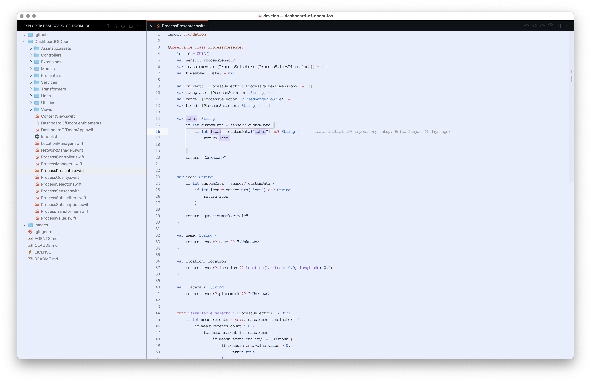

# Super Theme Collection

A sophisticated collection of VS Code themes featuring carefully crafted color palettes.

## Changelog

## Available Themes

### Super Black
A sophisticated dark theme inspired by the GitHub Dark Colorblind theme with deep black backgrounds for comfortable low-light coding.

### Super White
A clean light theme based on GitHub Light Colorblind with crisp whites and high contrast for bright environment coding.

### Super Light
A soft light theme with a gentle blue tint, offering a comfortable and easy-on-the-eyes experience for bright environment coding.

### Super Blue
A calming blue-tinted dark theme with blue backgrounds and accents, perfect for a soothing coding experience in low-light environments.

## Features

- **Multiple Variants**: Black, White, Light, and Blue themes for different lighting conditions and preferences
- **Deep Black Background**: Ultra-dark editor background (#010409) for reduced eye strain in low-light environments
- **Clean White Background**: Pure white editor background (#ffffff) for bright, high-contrast environments
- **Soft Light Background**: Gentle blue-tinted editor background (#e8eefe) for comfortable bright environment coding
- **Calming Blue Background**: Blue-tinted editor background (#0a0e1a) for a soothing coding experience
- **High Contrast**: Carefully balanced contrast ratios for excellent readability across all variants
- **Comprehensive Coverage**: Full theming of all VS Code UI elements including editor, sidebar, terminal, and panels
- **Syntax Highlighting**: Rich color palette for code syntax highlighting across multiple programming languages
- **Git Integration**: Clear visual indicators for git status and diff highlighting
- **Terminal Colors**: Complete ANSI color palette for integrated terminal
- **Error Lens Support**: Built-in support for Error Lens extension with custom colors

## Color Palettes

### Super Black
The dark theme uses a refined color palette based on GitHub's dark design system:

- **Primary Background**: `#010409` - Deep black for main editor
- **Secondary Background**: `#0d1117` - Slightly lighter for tabs and headers
- **Accent Color**: `#f78166` - Orange accent for active elements
- **Text Primary**: `#c9d1d9` - High contrast white for main text
- **Text Secondary**: `#8b949e` - Muted for secondary text

### Super White
The light theme uses a clean color palette based on GitHub's light design system:

- **Primary Background**: `#ffffff` - Pure white for main editor
- **Secondary Background**: `#f6f8fa` - Light gray for tabs and headers
- **Accent Color**: `#fd7e14` - Orange accent for active elements
- **Text Primary**: `#1f2328` - High contrast black for main text
- **Text Secondary**: `#656d76` - Muted for secondary text

### Super Light
The soft light theme uses a gentle color palette with blue tints for comfortable extended coding sessions:

- **Primary Background**: `#e8eefe` - Soft blue tint for main editor
- **Secondary Background**: `#f6f8fa` - Light gray for tabs and headers
- **Accent Color**: `#0969da` - Blue accent for active elements
- **Text Primary**: `#1f2328` - High contrast black for main text
- **Text Secondary**: `#656d76` - Muted for secondary text

### Super Blue

The blue theme uses a calming blue-tinted color palette for a soothing coding experience:

- **Primary Background**: `#0a0e1a` - Deep blue-black for main editor
- **Secondary Background**: `#1a202c` - Slightly lighter blue for tabs and headers
- **Accent Color**: `#3182ce` - Blue accent for active elements
- **Text Primary**: `#e2e8f0` - High contrast white for main text
- **Text Secondary**: `#a0aec0` - Muted for secondary text

### Syntax Colors (All Themes)
- **Keywords**: Red tones for language keywords
- **Strings**: Blue tones for string literals
- **Functions**: Purple tones for function names
- **Numbers**: Blue tones for numeric literals
- **Comments**: Gray tones with italic styling

## Installation

### From Source
1. Clone this repository
2. Copy the theme files to your VS Code extensions directory
3. Open VS Code and go to Preferences > Color Theme
4. Select "Super Black", "Super White", "Super Light", or "Super Blue" from the list

### Development Installation
1. Open this project in VS Code
2. Press `F5` to launch Extension Development Host
3. In the new window, select "Super Black", "Super White", "Super Light", or "Super Blue" theme

## Customization

You can customize specific colors by adding overrides to your VS Code settings:

```json
{
  "workbench.colorCustomizations": {
    "[Super Black]": {
      "editor.background": "#000000"
    },
    "[Super White]": {
      "editor.background": "#f8f9fa"
    },
    "[Super Light]": {
      "editor.background": "#f0f4ff"
    },
    "[Super Blue]": {
      "editor.background": "#0c1221"
    }
  }
}
```

## Screenshots

### Super Black Theme


### Super White Theme


### Super Blue Theme


### Super Light Theme


## License

MIT License - see LICENSE file for details.

## Changelog

### 1.1.2

- Added extension icon (super-themes.png)
- Enhanced marketplace presentation with custom branding

### 1.1.1

- Added screenshots to README documentation
- Removed Contributing section for cleaner documentation
- Documentation improvements and cleanup

### 1.1.0

- Version bump to 1.1.0
- Preparing for color theme improvements
- Updated project documentation

### 1.0.10

- Updated version for workflow improvements
- Modernized GitHub Actions workflow with GitHub CLI
- Fixed release creation permissions issues
- Updated documentation and version references

### 1.0.7

- Initial release
- Complete theme coverage for all VS Code UI elements
- Syntax highlighting for major programming languages
- Error Lens extension support
- Git integration colors
