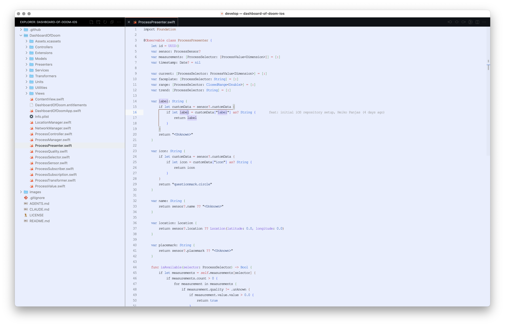
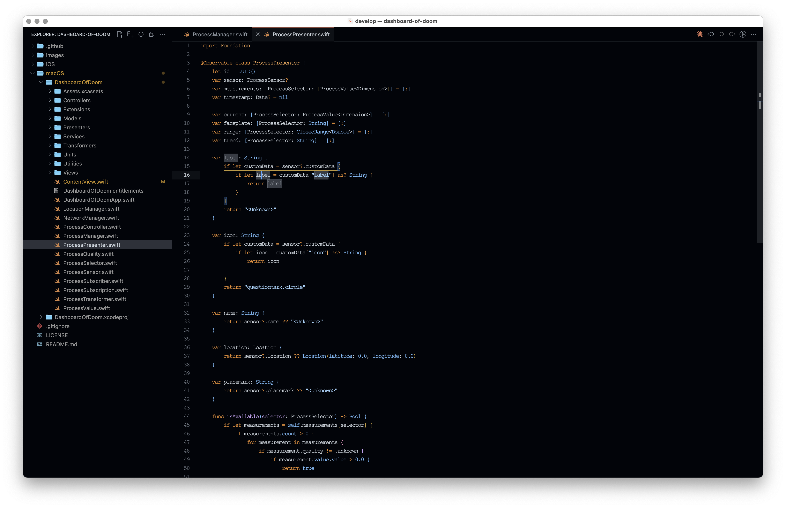
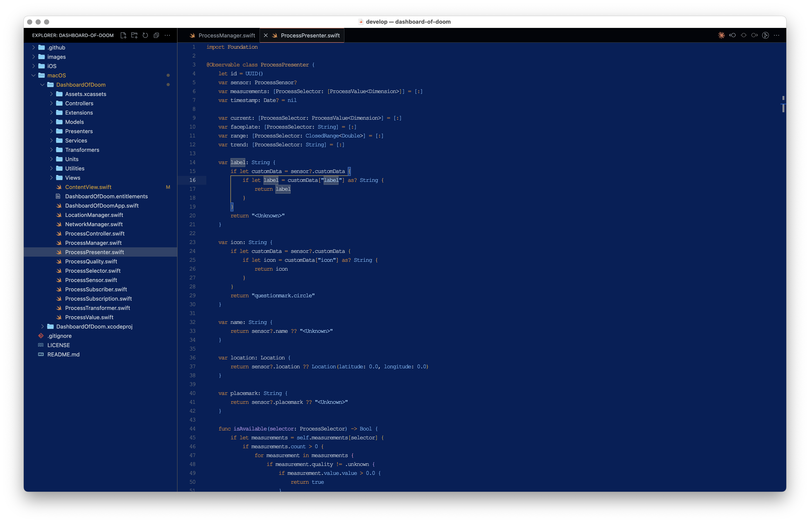
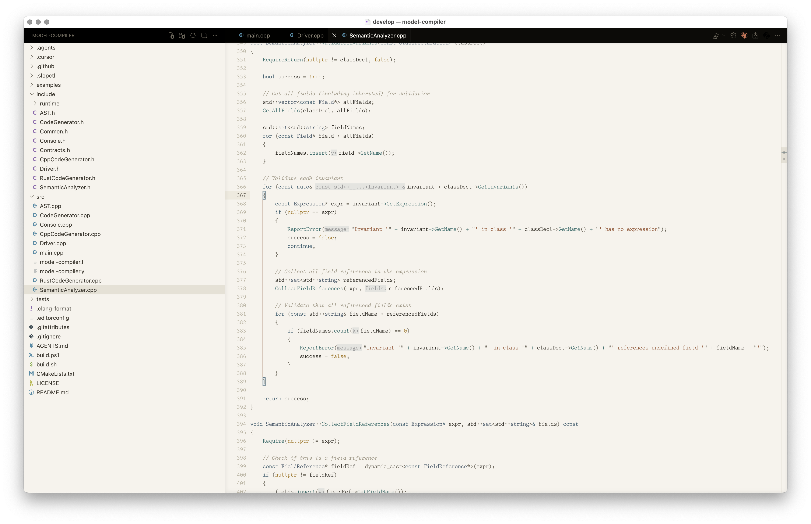

# Berlin Postal Themes

VS Code themes inspired by historic Berlin postal districts (Postzustellbezirke). Each theme represents a different district from West Berlin's postal system, bringing a piece of Berlin's urban history to your coding environment.

## About Berlin Postzustellbezirke

The Postzustellbezirke were postal delivery districts used in Berlin from the 1960s to 1993. These codes helped organize mail delivery across the divided city. This theme collection pays homage to six West Berlin districts, each with its own character and coding atmosphere.

## Available Themes

### NW21 (Nordwest 21 - Moabit)

Named after the postal district that covered Moabit's factory quarter — home to the *AEG-Turbinenhalle* on Huttenstraße, Peter Behrens's 1909 masterpiece of industrial modernism and one of the first buildings where steel-and-glass engineering was treated as architecture in its own right. The hall's north-facing clerestory windows flood the interior with cool, diffused daylight that never bleaches or glares.

That light is the theme. A pale sky-blue wash (`#e8eefe`) replaces clinical white — soft enough to read for hours without fatigue. Accents stay close to the palette: cool slate-blue for active elements (`#0969da`), muted punctuation, and a dark charcoal foreground (`#1f2328`) with just enough warmth to avoid the coldness of pure black. Nothing fights for attention; the colours work the way the vTurbinenhalle's structure works — everything in service of what happens inside.

**Best for:** long sessions in bright rooms and anyone who finds pure-white themes too harsh.

### W30 (West 30 - Schöneberg)

Named after the postal district whose two centres pull in opposite directions: *Winterfeldtplatz*, where the Saturday market packs the square with colour from dawn until early afternoon and the surrounding cafés stay lit well into the night; and *Nollendorfplatz*, a short walk south, where the 1902 Jugendstil junction building by Johannes Vollmer has anchored the heart of Schöneberg's nightlife for over a century. After midnight, when the market stalls are long gone and the square is empty, the two places belong to the same darkness.

That darkness is the theme. The editor drops to near-black (`#010409`) — dark enough to dissolve the screen border in a dimly lit room. Text floats in cool silver-gray (`#c9d1d9`), catching the eye without burning it. The only colour comes from accent elements: a steel-blue cursor (`#58a6ff`) and warm coral-orange tab borders (`#f78166`) — the cold blue of a bar sign reflected in wet cobblestones and the amber glow spilling from a window on Winterfeldtstraße at 2 a.m.

**Best for:** night-time coding, dark rooms, and anyone who wants the screen to recede and only the code to glow.

### SW61 (Südwest 61 - Kreuzberg)

Named after the postal district whose most quietly iconic building is the *Amerika-Gedenkbibliothek* on Blücherplatz — a gift from the American people to West Berlin after the airlift, opened in 1954 to Fritz Bornemann's modernist design. From across the square at dusk, the deep-set reading rooms glow with cool institutional light against a facade that has already dissolved into the darkening Prussian-blue sky above Kreuzberg.

That dusk is the theme. The editor background sinks to a deep navy (`#00205A`) — not black, but the colour of the sky just before it commits to night. Text sits in the same silver-gray (`#c9d1d9`) as the other dark themes, steady and readable without fighting the blue. Accents — cursors, active tabs, highlights — pick up the steel blue of the library's interior light (`#58a6ff`), a cool counterpoint to the warm world outside.

**Best for:** evening sessions, anyone who finds pure-black themes oppressive, and those who prefer depth over darkness.

### SO36 (Südost 36 - Kreuzberg)

Named after the postal district whose social centre is *Kottbusser Tor* — a brutalist concrete junction from the early 1970s where six streets converge under a raised housing block and the whole thing hums with the noise of the city at every hour. The *Kotti* is not picturesque. It is loud, dense, and lit from every angle: fluorescent tubes from the shops below, sodium-orange from the street lamps, cold white from the döner counters, and the hard blue wash of a security light catching the concrete overhead.

That overlap of hard light and raw structure is the theme. The editor sits in a medium-dark cobalt (`#204b81`) — brighter and rawer than SW61's deep navy, because the Kotti is never subdued. The title bar cuts through with electric cyan (`#00ccff`), the colour of that security light against bare concrete at midnight. Text is the same reliable silver-gray (`#c9d1d9`), but here it reads like a posted flyer: direct, purposeful, not asking permission.

**Best for:** coders who want presence and energy from their environment, not just a neutral backdrop.

### SW11 (Südwest 11 - Kreuzberg)

Named after the *Großbriefverteileramt SW 11* beside the Anhalter Bahnhof — for decades the largest mail-sorting center in Berlin and, after 1962, the hub that routed letters for all of West Berlin. It is one of the few large 1930s buildings still standing in Kreuzberg, a listed monument whose pale natural-stone facade blends sober *Neues Bauen* lines with monumental classicism.

That stone is the theme. A warm limestone white (`#f6f3ec`) stands in for clinical white, with restrained accents borrowed from the building and its station: wrought-iron slate-blue keywords (`#3c6070`), Anhalter brick-red strings (`#704214`), and muted ochre numbers (`#5c4a00`). Everything is deliberately desaturated so it stays calm across long sessions.

**Best for:** daylight coding and anyone who finds pure-white themes too harsh.

### 41 (Berlin 41 - Steglitz)

Named after the postal district that covers Schloßstraße, where the *Bierpinsel* has balanced on its concrete stalk since 1976 — Ralf Schüler and Ursulina Schüler-Witte's pop-brutalist tower restaurant, a faceted crown of windows lifted twenty-seven metres above the traffic. Repainted in 2010, its angular facade panels glow a warm salmon-orange against the graphite-grey ventilation louvres that band the top storey, with hard signal-red lines tracing every window frame.

That contrast is the theme. The editor sits in the louvre grey (`#2e3133`) — a flat, matte graphite that never turns blue or brown. Text is the facade itself (`#e89279`), warm without being loud, and keywords take the signal red of the window frames (`#ff6e4a`, set in bold so weight carries the emphasis as well as colour). Strings pick up the raw concrete of the stalk below (`#ded9cf`) and types borrow the Steglitz sky the tower stands against (`#7fb3d5`).

**Best for:** coders who want a warm, low-blue dark theme with a single decisive accent.

## Features

- **Berlin Heritage**: Six distinct themes inspired by historic West Berlin postal districts
- **NW21 Moabit**: Soft light theme with gentle blue tint (#e8eefe) for comfortable extended coding
- **W30 Schöneberg**: Ultra-dark theme with deep black background (#010409) for low-light environments
- **SW61 Kreuzberg**: Blue-tinted dark theme (#00205A) for a calming coding experience
- **SO36 Kreuzberg**: Medium-dark blue theme (#204b81) with distinctive cyan title bar (#00ccff)
- **SW11 Kreuzberg**: Warm limestone-white light theme (#f6f3ec) for calm daylight coding
- **41 Steglitz**: Graphite-grey dark theme (#2e3133) with warm Bierpinsel salmon text (#e89279)
- **High Contrast**: Carefully balanced contrast ratios for excellent readability across all themes
- **Comprehensive Coverage**: Full theming of all VS Code UI elements including editor, sidebar, terminal, and panels
- **Syntax Highlighting**: Rich color palette for code syntax highlighting across multiple programming languages
- **Git Integration**: Clear visual indicators for git status and diff highlighting
- **Terminal Colors**: Complete ANSI color palette for integrated terminal
- **Error Lens Support**: Built-in support for Error Lens extension with custom colors

## Color Palettes

### NW21 (Nordwest 21 - Moabit)

A soft light theme inspired by Moabit's industrial and creative character:

- **Primary Background**: `#e8eefe` - Soft blue tint for main editor
- **Secondary Background**: `#f6f8fa` - Light gray for tabs and headers
- **Accent Color**: `#0969da` - Blue accent for active elements
- **Text Primary**: `#1f2328` - High contrast black for main text
- **Text Secondary**: `#656d76` - Muted for secondary text

### W30 (West 30 - Schöneberg)

An ultra-dark theme reflecting Schöneberg's vibrant nightlife:

- **Primary Background**: `#010409` - Deep black for main editor
- **Secondary Background**: `#0d1117` - Slightly lighter for tabs and headers
- **Accent Color**: `#f78166` - Orange accent for active elements
- **Text Primary**: `#c9d1d9` - High contrast white for main text
- **Text Secondary**: `#8b949e` - Muted for secondary text

### SW61 (Südwest 61 - Kreuzberg)

A calming blue theme representing Kreuzberg's alternative culture:

- **Primary Background**: `#00205A` - Deep blue for main editor
- **Secondary Background**: `#0d1117` - Slightly lighter for tabs and headers
- **Accent Color**: `#f78166` - Orange accent for active elements
- **Text Primary**: `#c9d1d9` - High contrast white for main text
- **Text Secondary**: `#8b949e` - Muted for secondary text

### SO36 (Südost 36 - Kreuzberg)

A bold dark theme capturing the punk spirit of SO36:

- **Primary Background**: `#204b81` - Medium-dark blue for main editor
- **Secondary Background**: `#0d1117` - Slightly lighter for tabs and headers
- **Title Bar**: `#00ccff` - Distinctive cyan for an unmistakable identity
- **Accent Color**: `#f78166` - Orange accent for active elements
- **Text Primary**: `#c9d1d9` - High contrast white for main text
- **Text Secondary**: `#8b949e` - Muted for secondary text

### SW11 (Südwest 11 - Kreuzberg)

A warm light theme inspired by the sober classicism of the Großbriefverteileramt SW 11:

- **Primary Background**: `#f6f3ec` - Warm limestone white for main editor
- **Accent Color**: `#3c6070` - Slate-blue for keywords
- **Strings**: `#704214` - Anhalter brick-red for string literals
- **Numbers**: `#5c4a00` - Muted ochre for numeric literals
- **Text Primary**: `#2b2b2b` - Dark gray for main text

### 41 (Berlin 41 - Steglitz)

A warm dark theme taken from the Bierpinsel on Schloßstraße:

- **Primary Background**: `#2e3133` - Graphite grey of the ventilation louvres
- **Secondary Background**: `#232627` - Darker graphite for tabs, activity bar and status bar
- **Text Primary**: `#e89279` - Salmon-orange of the facade panels
- **Accent Color**: `#e8402c` - Signal red of the window frames, used for the title bar and borders
- **Keywords**: `#ff6e4a` - Lightened signal red, bold, for WCAG AA contrast
- **Strings**: `#ded9cf` - Raw concrete of the supporting stalk
- **Types**: `#7fb3d5` - Steglitz sky behind the tower
- **Constants**: `#f2cf85` - Warm sandstone of the surrounding blocks

### Syntax Colors (All Themes)

- **Keywords**: Red and orange tones for language keywords
- **Strings**: Blue tones for string literals
- **Functions**: Purple tones for function names
- **Numbers**: Blue tones for numeric literals
- **Comments**: Gray tones for readability

## Installation

### From Source

1. Clone this repository
2. Copy the theme files to your VS Code extensions directory
3. Open VS Code and go to Preferences > Color Theme
4. Select your preferred Berlin district theme: "NW21", "W30", "SW61", "SO36", "SW11", or "41"

### Development Installation

1. Open this project in VS Code
2. Press `F5` to launch Extension Development Host
3. In the new window, select your preferred Berlin district theme

## Customization

You can customize specific colors by adding overrides to your VS Code settings:

```json
{
  "workbench.colorCustomizations": {
    "[NW21 (Nordwest 21 - Moabit)]": {
      "editor.background": "#f0f4ff"
    },
    "[W30 (West 30 - Schöneberg)]": {
      "editor.background": "#000000"
    },
    "[SW61 (Südwest 61 - Kreuzberg)]": {
      "editor.background": "#001a4d"
    },
    "[SO36 (Südost 36 - Kreuzberg)]": {
      "editor.background": "#1a3d6e"
    },
    "[SW11 (Südwest 11 - Kreuzberg)]": {
      "editor.background": "#ede9e0"
    },
    "[41 (Berlin 41 - Steglitz)]": {
      "editor.background": "#26292a"
    }
  }
}
```

## Screenshots

### NW21 (Nordwest 21 - Moabit)



### W30 (West 30 - Schöneberg)



### SW61 (Südwest 61 - Kreuzberg)



### SO36 (Südost 36 - Kreuzberg)


### SW11 (Südwest 11 - Kreuzberg)



## License

MIT License - see LICENSE file for details.

## Changelog

### 3.1.1

- **Fix**: Unified the tab bar, tabs and sidebar title bar across all six themes; these are shared brand elements that had drifted apart between variants
- **Fix**: Lightened the SW11 active tab accent so it stays visible on the dark tab strip
- **Fix**: W30 was missing the black sidebar title bar

### 3.1.0

- **New Theme**: Added 41 (Berlin 41 - Steglitz) as sixth theme variant
- **Inspiration**: The Bierpinsel tower restaurant on Schloßstraße
- **Distinctive Style**: Graphite-grey background (#2e3133) with salmon-orange facade text (#e89279) and signal-red accents (#e8402c)
- **Character**: Pop-brutalist warmth for a low-blue dark coding environment
- **Accessibility**: Colorblind-friendly palette, all syntax tokens meet WCAG AA contrast on the editor background

### 3.0.0

- **Accessibility**: Colorblind-friendly palettes across all five themes

### 2.2.2

- **Accessibility**: Improved colorblind friendliness across all five themes
- **Theme Quality**: Strengthened token contrast under simulated color vision deficiencies
- **Git Colors**: Improved added, modified and deleted color separation
- **Packaging**: Excluded development-only files from the VSIX package
- **CI**: Added package validation to the GitHub Actions workflow

### 2.2.1

- **Documentation**: Revised theme descriptions for W30 and SO36
- **Assets**: Renamed screenshot files to match district codes

### 2.2.0

- **New Theme**: Added SW11 (Südwest 11 - Kreuzberg) as fifth theme variant
- **Inspiration**: Großbriefverteileramt SW 11 beside Anhalter Bahnhof, warm limestone facade
- **Distinctive Style**: Warm limestone-white background (#f6f3ec) with desaturated slate-blue, brick-red and ochre accents
- **Character**: Sober Neues Bauen classicism for calm daylight coding sessions
- **Updated Documentation**: README and AGENTS.md reflect five-theme collection

### 2.1.0

- **New Theme**: Added SO36 (Südost 36 - Kreuzberg) as fourth theme variant
- **Distinctive Style**: Cyan title bar (#00ccff) and medium-dark blue background (#204b81)
- **Character**: Captures the raw punk energy of the iconic SO36 sub-district
- **Updated Documentation**: README and AGENTS.md reflect four-theme collection

### 2.0.0

- **Major Rebrand**: Renamed from "Super Theme Collection" to "Berlin Postal Themes"
- **Theme Renames**:
  - Super Light → NW21 (Nordwest 21 - Moabit)
  - Super Black → W30 (West 30 - Schöneberg)
  - Super Blue → SW61 (Südwest 61 - Kreuzberg)
- **Removed**: Super White theme discontinued
- **Theme Concept**: Themes now inspired by historic Berlin postal districts (Postzustellbezirke)
- **Updated Documentation**: Complete rewrite with Berlin heritage context
- **Breaking Change**: Theme names and file names have changed; users will need to re-select their preferred theme

### 1.2.0

- Added new Super Light theme with gentle blue tint
- Updated documentation to include all four theme variants
- Enhanced theme collection with soft light alternative to Super White

### 1.1.2

- Added extension icon (super-themes.png)
- Enhanced marketplace presentation with custom branding

### 1.1.1

- Added screenshots to README documentation
- Removed Contributing section for cleaner documentation
- Documentation improvements and cleanup

### 1.1.0

- Version bump to 1.1.0
- Preparing for color theme improvements
- Updated project documentation

### 1.0.10

- Updated version for workflow improvements
- Modernized GitHub Actions workflow with GitHub CLI
- Fixed release creation permissions issues
- Updated documentation and version references

### 1.0.7

- Initial release
- Complete theme coverage for all VS Code UI elements
- Syntax highlighting for major programming languages
- Error Lens extension support
- Git integration colors
