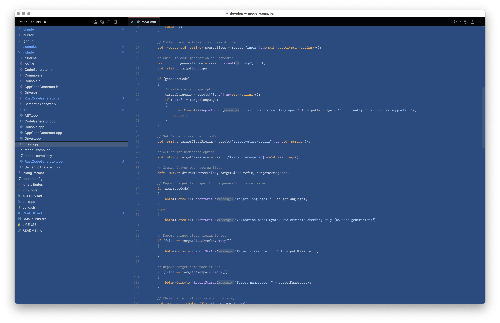

# Berlin Postal Themes

VS Code themes inspired by historic Berlin postal districts (Postzustellbezirke). Each theme represents a different district from West Berlin's postal system, bringing a piece of Berlin's urban history to your coding environment.

## About Berlin Postzustellbezirke

The Postzustellbezirke were postal delivery districts used in Berlin from the 1960s to 1993. These codes helped organize mail delivery across the divided city. This theme collection pays homage to four West Berlin districts, each with its own character and coding atmosphere.

## Available Themes

### NW21 (Nordwest 21 - Moabit)

A soft light theme with a gentle blue tint, representing the industrial and creative spirit of Moabit. Perfect for comfortable extended coding sessions in bright environments.

### W30 (West 30 - Schöneberg)

An ultra-dark theme inspired by Schöneberg's vibrant nightlife and cultural scene. Deep black backgrounds (#010409) provide maximum contrast for low-light coding.

### SW61 (Südwest 61 - Kreuzberg)

A calming blue-tinted dark theme reflecting Kreuzberg's alternative culture and creative energy. Blue backgrounds and accents create a soothing coding experience.

### SO36 (Südost 36 - Kreuzberg)

A medium-dark blue theme capturing the raw punk energy of SO36, the iconic Kreuzberg sub-district. The distinctive cyan title bar (#00ccff) gives it a bold, unmistakable identity.

## Features

- **Berlin Heritage**: Four distinct themes inspired by historic West Berlin postal districts
- **NW21 Moabit**: Soft light theme with gentle blue tint (#e8eefe) for comfortable extended coding
- **W30 Schöneberg**: Ultra-dark theme with deep black background (#010409) for low-light environments
- **SW61 Kreuzberg**: Blue-tinted dark theme (#00205A) for a calming coding experience
- **SO36 Kreuzberg**: Medium-dark blue theme (#204b81) with distinctive cyan title bar (#00ccff)
- **High Contrast**: Carefully balanced contrast ratios for excellent readability across all themes
- **Comprehensive Coverage**: Full theming of all VS Code UI elements including editor, sidebar, terminal, and panels
- **Syntax Highlighting**: Rich color palette for code syntax highlighting across multiple programming languages
- **Git Integration**: Clear visual indicators for git status and diff highlighting
- **Terminal Colors**: Complete ANSI color palette for integrated terminal
- **Error Lens Support**: Built-in support for Error Lens extension with custom colors

## Color Palettes

### NW21 (Nordwest 21 - Moabit)

A soft light theme inspired by Moabit's industrial and creative character:

- **Primary Background**: `#e8eefe` - Soft blue tint for main editor
- **Secondary Background**: `#f6f8fa` - Light gray for tabs and headers
- **Accent Color**: `#0969da` - Blue accent for active elements
- **Text Primary**: `#1f2328` - High contrast black for main text
- **Text Secondary**: `#656d76` - Muted for secondary text

### W30 (West 30 - Schöneberg)

An ultra-dark theme reflecting Schöneberg's vibrant nightlife:

- **Primary Background**: `#010409` - Deep black for main editor
- **Secondary Background**: `#0d1117` - Slightly lighter for tabs and headers
- **Accent Color**: `#f78166` - Orange accent for active elements
- **Text Primary**: `#c9d1d9` - High contrast white for main text
- **Text Secondary**: `#8b949e` - Muted for secondary text

### SW61 (Südwest 61 - Kreuzberg)

A calming blue theme representing Kreuzberg's alternative culture:

- **Primary Background**: `#00205A` - Deep blue for main editor
- **Secondary Background**: `#0d1117` - Slightly lighter for tabs and headers
- **Accent Color**: `#f78166` - Orange accent for active elements
- **Text Primary**: `#c9d1d9` - High contrast white for main text
- **Text Secondary**: `#8b949e` - Muted for secondary text

### SO36 (Südost 36 - Kreuzberg)

A bold dark theme capturing the punk spirit of SO36:

- **Primary Background**: `#204b81` - Medium-dark blue for main editor
- **Secondary Background**: `#0d1117` - Slightly lighter for tabs and headers
- **Title Bar**: `#00ccff` - Distinctive cyan for an unmistakable identity
- **Accent Color**: `#f78166` - Orange accent for active elements
- **Text Primary**: `#c9d1d9` - High contrast white for main text
- **Text Secondary**: `#8b949e` - Muted for secondary text

### Syntax Colors (All Themes)

- **Keywords**: Red and orange tones for language keywords
- **Strings**: Blue tones for string literals
- **Functions**: Purple tones for function names
- **Numbers**: Blue tones for numeric literals
- **Comments**: Gray tones for readability

## Installation

### From Source

1. Clone this repository
2. Copy the theme files to your VS Code extensions directory
3. Open VS Code and go to Preferences > Color Theme
4. Select your preferred Berlin district theme: "NW21", "W30", "SW61", or "SO36"

### Development Installation

1. Open this project in VS Code
2. Press `F5` to launch Extension Development Host
3. In the new window, select your preferred Berlin district theme

## Customization

You can customize specific colors by adding overrides to your VS Code settings:

```json
{
  "workbench.colorCustomizations": {
    "[NW21 (Nordwest 21 - Moabit)]": {
      "editor.background": "#f0f4ff"
    },
    "[W30 (West 30 - Schöneberg)]": {
      "editor.background": "#000000"
    },
    "[SW61 (Südwest 61 - Kreuzberg)]": {
      "editor.background": "#001a4d"
    },
    "[SO36 (Südost 36 - Kreuzberg)]": {
      "editor.background": "#1a3d6e"
    }
  }
}
```

## Screenshots

### NW21 (Nordwest 21 - Moabit)


### W30 (West 30 - Schöneberg)


### SW61 (Südwest 61 - Kreuzberg)


### SO36 (Südost 36 - Kreuzberg)



## License

MIT License - see LICENSE file for details.

## Changelog

### 2.1.0

- **New Theme**: Added SO36 (Südost 36 - Kreuzberg) as fourth theme variant
- **Distinctive Style**: Cyan title bar (#00ccff) and medium-dark blue background (#204b81)
- **Character**: Captures the raw punk energy of the iconic SO36 sub-district
- **Updated Documentation**: README and AGENTS.md reflect four-theme collection

### 2.0.0

- **Major Rebrand**: Renamed from "Super Theme Collection" to "Berlin Postal Themes"
- **Theme Renames**:
  - Super Light → NW21 (Nordwest 21 - Moabit)
  - Super Black → W30 (West 30 - Schöneberg)
  - Super Blue → SW61 (Südwest 61 - Kreuzberg)
- **Removed**: Super White theme discontinued
- **Theme Concept**: Themes now inspired by historic Berlin postal districts (Postzustellbezirke)
- **Updated Documentation**: Complete rewrite with Berlin heritage context
- **Breaking Change**: Theme names and file names have changed; users will need to re-select their preferred theme

### 1.2.0

- Added new Super Light theme with gentle blue tint
- Updated documentation to include all four theme variants
- Enhanced theme collection with soft light alternative to Super White

### 1.1.2

- Added extension icon (super-themes.png)
- Enhanced marketplace presentation with custom branding

### 1.1.1

- Added screenshots to README documentation
- Removed Contributing section for cleaner documentation
- Documentation improvements and cleanup

### 1.1.0

- Version bump to 1.1.0
- Preparing for color theme improvements
- Updated project documentation

### 1.0.10

- Updated version for workflow improvements
- Modernized GitHub Actions workflow with GitHub CLI
- Fixed release creation permissions issues
- Updated documentation and version references

### 1.0.7

- Initial release
- Complete theme coverage for all VS Code UI elements
- Syntax highlighting for major programming languages
- Error Lens extension support
- Git integration colors
